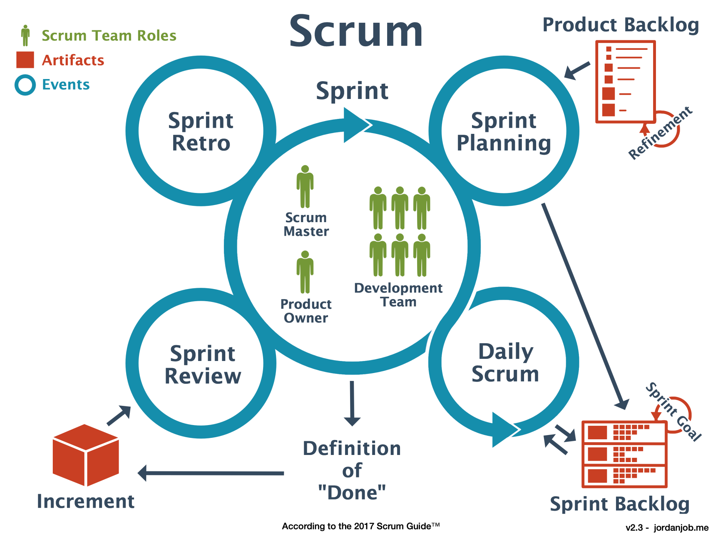

## Introduction
People working with IT(me included) probably have heard this phrase after you gave a due date to the product team:
> But your team is Agile, that doesn't mean this task should be finisher faster? 

To be honest they aren't wrong, Agile method it's a approach to increase the delivery faster than others methodology, even Attlasian mention that in their website: 
> Agile is an iterative approach to project management and software development that helps teams deliver value to their customers **faster** and with fewer headaches.

But in this article I'll try to explain why being Agile not necessary means you finish all project faster, instead means the company can give delivery small results faster resulting into more adapability for future changes.

Agile is a mindset that needs to be comprehend by all people involved on the project in order to work, if a company tries to be Agile but prioritize finish everything fast avoiding some principles of Agile, the project will not be agile when a change will be needed and probably will not be finished fast.

What I want to clarify in this article is the impacts of avoiding Agile principles, if you want more details about the Agile manifesto and mindset my recommendation is to read this article: https://kwan.pt/blog/applying-the-agile-manifesto-to-build-an-agile-mindset.

<!-- That's what I want to explain in this article, why is important to understand and respect the process to be Agile then you start to become Faster. -->

<!-- But take a proccess to have a Agile culture, and this proccess needs to be respect, after the culture is finish the company starts to be faster. And that's what I want to explain in this article, why is important to be Agile first before being Faster. -->

## Meaning of Agile
So to start I want to clarify what the word agile means.
By Cambrigde:
> - able to move your body quickly and easily

<!-- The word faster isn't mentioned on definition and synonimus list, in the other hand Merriam-Webster list synonimus words: Flexible and Coordinate. -->

That's what agile means by definition, but how the company can be turned into a Agile company?

Agile has a lot of framework that can helps the company to be turn into, but for this article I'll use as a example the Scrum framework.

So let's starts talking about how Scrum works and can help the company have a Agile mindset.

<!-- So instead other methods which needs to plan all project and then development, Agile separating the project into short periods makes the project quicker and easy to adapt when needs changes or failures while keeping running the project.  -->

<!-- The same definition the word has.  -->

<!-- Now, how Agile does that?  -->
<!-- Agile has a lot of options to do that, -->

## Procceses of Agile
<!-- Scrum has cycles with few steps that needs to be repected in order to be Agile and stay Fast on development delivery of the project. -->

<!-- Scrum is a framework that helps the company starts to think into more Agile way, Scrum brings to the project management the idea of constant delivery and planning, this concepts come from a unique characterisc: Cycle steps -->

Most of IT projects isn't a straight line, failures will happens or some parts will be changed in the long of the development, but with Scrum the project can be more adaptable to solute this problems.

Because Scrum tries to separate the project into small pieces that can be planned and delivered into short period of time (2, 3, 4 weeks), with this characterisc it's brings to the project more adapability to change the project while still developing the project.

On Scrum the team have a team structure of:
- Product Owner
- Developer
- Scrum Master

Every project has a product backlog tasks, the product backlog are the small pieces that will be develop into the short period of time.

The team has a member encharged to manage and create the product backlog is the Product Owner, his responsibilities is to understand the customer and business requirements separate into tasks and add to the product backlog, and to define the value and goal for each sprint.

Developers are the members that will move the tasks and build the project to delivery for the customers, the members could be programmers, designers, writers or QA.

Scrum Masters are the members to train the members about the Scrum methodology, he can help the Product Owner to define the value and guide the Developers to delivery the sprint value.

Scrum has a cycle of steps called Rituals that need to be followed:
- Planning
- Sprint
- Retro

Planning is a meeting normally presented by the product owner to present the sprint backlog, the Product Owner take tasks from the product backlog and describe each of the tasks and goal for the sprint to the team, the Developers and Scrum Master needs to understand the tasks and bring if has something missing or a block that result into not finish the task to the discussion. After all tasks was described and discussed the team have a agreedment about the tasks and goals for that sprint.

<!-- Planning is a meeting normally presented by the product owner, this meeting  the product owner present the goals of the sprint and the tasks for the next sprint, then all team members starts to discuss about each tasks trying to see if has any blocks that can stop him during the sprint. After all discussion the team have a agreedment about the tasks will be developed into the next Sprint. -->

Then the Sprint starts, here the developers get their tasks to develop. On this step the team reunite every day to a call Daily it's a quick meeting to the team give a update about their tasks, with that meeeting the team can be more agile to change their plans to reach their goals of the current sprint, because it's a daily meeting update the team can see quickly if a task will take more time so they can move more people working in that particualy tasks or desprioritize other low priority tasks and still reach the main goal of that sprint.

<!-- In this phase it's very important the product member clarify the reasons of each, what the company expects from that tasks and the team needs to know if has any risks (blocks) to take that task. After the planning is over, everyone in the meeting need to have clear what will be prioritaze in order to have a successful sprint. -->

<!-- SCRUM always starts with a planning meeting, the product team presents some tasks from the project to the development team. The goal is to understand the tasks, discuss about the implementation, possible problems that can block the task to be finish. -->

<!-- After the Planning, Sprint steps starts. Here the developers starts work on their tasks planned, in this phase is pretty important to not interrupt with another feature in the project, if has the company needs to understand that's better to wait to the next cycle, because could be planned with the team -->

When the limit of the short period is over, the team reunites again to present their tasks and values delivered in that sprint, its a meeting to discuss about the current sprint too it's a great opportunity adjust their mistakes and continue what is going well to the next sprint.

Then after the Retro, a new cycle starts with new Planning and the same steps.

This steps bring to the project a flexibility to change the project ideas, because after each short period the stakeholders and customers can see the smal piece of the project so has quick feedback about the project, and if needs to change something the Product Owner just put a new task on the product backlog, and the development team can starts to work on the next sprint.

<!-- With a well coordinate team, the company can have a fast and agile sprint on the same time. But in order to have that, the team needs to have a great communication between the members and the company needs to understand the process and not intefer the sprint goals while the team still running a sprint, most of this inteferations creates blocks or maybe will have a high chance of failures when it goes to production for both of possibilities the reason is the same: tasks wans't planned correctly, the company wanted to faster rather than being agile first and like I mentioned early IT project normally ins't a straight sometimes being agile is great. -->

With a well coordinate team, the company can have a fast and agile sprint on the same time. 
But in order to have that, the team needs to have a great communication between the members and the company needs to understand the process and not intefer the sprint goals while the team still running a sprint.

Those inteferations can disturb the communication between the team members, this could result into the project development focusing into a straight line to finish fast, instead of being a adapable to changes. That could cause future blocks or failures on the sprint phase with that resulting into a nonsucessful sprint.

To explain what I mean by the impact of intefer the team members while still running a sprint I'll ilustrate using a NFL play called running play.

## Example using NFL
The name SCRUM origin is from a sport called Rugby, on Rugby the SCRUM is called after some infringement of the Laws, the team reunites and the play is restarted.

As Agile, NFL is a sport based on Rugby, the goal of both sports is to advance into enemy field and score a touchdown or a field goal. The main diferrence is instead of wait some infringement on NFL after all plays the teams reunite. 

All plays on NFL starts with the coaches planning the play and informs to the Quarterback what play the team has to run, then the Quarterback informs to all players on the field what will be the play, formation and directions, then the players get set at their positions and the play starts.

One of the plays choosen by the coaches could be the running play, basicly the Quarteback gives the ball to the running-back and him has to wait the blocks to open a free open space to start run the sprint towards the goal.

In order to the play be successful the communication needs to clear and everyones understand the play, if not will be a easy task to defenders stop the play.

First I'll show a nonsucessful running play:

In this play the left defender was free to stop the runner to start the play.
The reason of the defender being free could be:
- Bad plan choose by the coaches
- Lack of communication with coaches or players
- Maybe the team wasn't expect a defender there

To any of this reasons the result is the same, the runner was stopped early resulting into a unsucessful sprint.

Now a example of a successful play:

This play everything went well, everyone understood their responsibilities resulting into a great initial blocks of defenders resulting into a great path for the running-back starts a great sprint.

After the running-back pass the blocks still some defenders left, but now is his responsibility to be Agile and change direction to avoid the defenders while still keeping runnning fast towards his goal(the endzone) and celebrate a great sprint with his team mates.

## Conclussion
In the NFL field the running-back are the fastest players on the field but being faster doesn't mean being the best player.

Is the same inside the company, you can have the fastest development team but like a running-back running towards a endzone, but like I said early in this artictle IT Projects ins't a straight line, the team needs to have a great plan and communication to avoid the blocks at the start of sprint, then the developer can starts to build a  Agile project to be prepare for late change directions while still running a Fast sprint towards the goal.

So to answer the question.
> But your team is Agile, that doesn't mean this task should be finisher faster? 

Yes the team is Agile, but that means is we are building a project that when will need a change of direction the team will be able to do while still running fast towards the finish.
