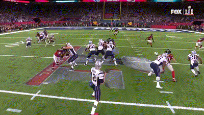
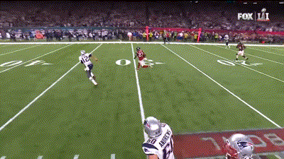
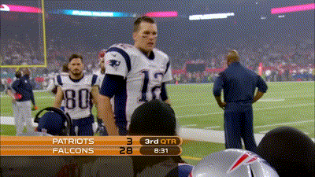

# Turning Mistakes into Triumphs: Lessons from Sports Legends for Success

Discover the hidden power of mistakes and learn how to turn setbacks into success. Explore lessons from sports legends like Michael Jordan and Tom Brady, whose resilience and focus transformed failures into historic victories. Whether in life or work, this article reveals how embracing mistakes can lead to greatness.

---

## The Power of Mistakes

When you make a mistake, what’s your reaction? For me, mistakes used to hit my confidence hard. They made me question whether I was capable of achieving my goals. It didn’t matter how much I had accomplished before—my mistakes always felt louder than my successes.

As a sports enthusiast, I spend most weekends watching games. Over time, I noticed how the most successful athletes dealt with challenges in their careers. They all had their share of failures—missed opportunities, bad decisions, and losses. Yet, these moments didn’t define them. Instead, they found ways to grow stronger from their mistakes.

Take **Michael Jordan**, for example. Widely regarded as the greatest basketball player of all time, Jordan won six NBA titles and never lost in the Finals. Yet, when reflecting on his success, he shared these powerful words:

> "I’ve missed more than 9,000 shots in my career. I’ve lost almost 300 games.  
> Twenty-six times, I’ve been trusted to take the game-winning shot and missed.  
> I’ve failed over and over and over again in my life. And that is why I succeed."

Even the most successful basketball player of all time had to fail repeatedly to achieve greatness. This completely shifted the way I thought about mistakes.

But then I wondered: **what about the other players?** Many have surely missed more shots and lost more games than Jordan. Why didn’t they succeed? What makes Jordan’s mistakes different? What’s the secret?

I didn’t get to see Michael Jordan play in real time, but I found the answer by watching another legendary athlete: **Tom Brady**, the most successful player in NFL history. His story, particularly his performance in **Super Bowl LI**, offered a powerful lesson about turning mistakes into triumphs.

---

## The Super Bowl Game

The **Super Bowl** is the pinnacle of the NFL season, where the AFC and NFC champions face off to crown the league’s victor. In 2017, the **New England Patriots**, led by quarterback **Tom Brady** and coach **Bill Belichick**, faced the **Atlanta Falcons**, an underdog team led by league MVP **Matt Ryan** and coach **Dan Quinn**.

### The Biggest Mistake

The game didn’t start well for the Patriots. The Falcons' defense was prepared to stop Brady and his teammates, while their offense managed to score two touchdowns in the first half.

This left Brady in a tough situation. With only a few minutes left in the half, he knew his team needed to score to build momentum for the second half. However, during this critical drive, he made a costly mistake:

In a high-pressure moment, Brady attempted a pass to a teammate covered by two Falcons defenders. One of the defenders intercepted the ball and sprinted toward the end zone. **Brady was the last line of defense but failed to stop him from scoring.**

This mistake not only gave the Falcons more points but also presented a psychological hurdle. Yet, Brady displayed remarkable composure, returning to the field to secure a field goal before the half ended.

---

## The Biggest Deficit in History

In the second half, the Falcons' offense struck again on their second possession, extending their lead to an imposing **28-3**. At that point, the broadcast highlighted a sobering fact: **no team had ever overcome a 25-point deficit in the Super Bowl.**

Despite the overwhelming odds, **Brady didn’t give up**. After the Falcons scored, he stepped in front of his teammates and delivered a motivating speech.

The situation didn’t shake his confidence—in himself or in his team. Brady knew there was still time to fight back and seize victory, and the only way to come back was to **be better on the next play**.

Inspired by his leadership, the Patriots answered with a touchdown. However, another mistake followed—the team failed to convert the extra point, leaving the score at **28-9** and the deficit still daunting.

---

## The Comeback

Fueled by Brady’s leadership, the Patriots began to chip away at the deficit. Play by play, they advanced down the field, scoring critical touchdowns while their defense stopped the Falcons’ once-dominant offense.

With under a minute left in regulation, Brady orchestrated a drive that ended with a touchdown and a game-tying two-point conversion, forcing overtime—the **first in Super Bowl history**.

---

## The Victory

In overtime, the Patriots won the coin toss, giving Brady the ball. He methodically led his team down the field, setting the stage for running back **James White** to score the game-winning touchdown.

The Patriots completed the greatest comeback in **Super Bowl history**, winning **34-28**.

---

## A Historic Achievement

Brady’s performance in **Super Bowl LI** was nothing short of legendary. He threw for a record-breaking **466 yards** and was named the game’s MVP. This victory marked his **fifth Super Bowl title**, surpassing his childhood idol, **Joe Montana**, and solidifying his place as one of the greatest athletes in sports history.

---

## Overcoming Every Situation

> "You make your mistakes, your mistakes never make ya.  
> I'm too obsessed with goin' down as a great one.  
> But if you wait too long, they gon' find someone to replace ya."  
> — *Mac Miller, "Goodspeed"*

After watching Brady’s comeback, I wondered how he managed to overcome such a difficult situation. **He never looked defeated in that game.**

I realized the answer lies in how American football reflects real-life experiences.

### The NFL as a Life Lesson

Like in life, the **NFL is a game of cycles**. Each team gets opportunities to attack and defend. As the leader of the Patriots' offense, Brady’s mistake handed the Falcons a significant advantage. Similarly, in life, when we’re pursuing a goal, the path isn’t always smooth—mistakes happen, setting us back and making success feel even more distant.

Brady, however, had a **clear goal**: to become the most accomplished player in American sports history, surpassing Michael Jordan’s five NBA championships. To achieve that, he couldn’t afford to lose this game. 

After the mistake, he didn’t dwell on it or the daunting score deficit. Instead, he quickly shifted his focus to **the next play**.

What set Brady apart wasn’t just his skill—it was his **resilience**. His ability to let go of setbacks, recalibrate, and focus on the ultimate goal made him extraordinary.

---

## They Don’t Care About Your Mistakes

> "Somebody gotta be watchin' you, but no one is.  
> It's kinda crazy that life could be this simple."  
> — *Mac Miller*

During halftime, I wondered how Brady managed **public criticisms** after his performance. I watched this game at a bar in Brazil. I remember people in that bar criticizing him, making bad comments about his performance. The atmosphere in the stadium was surely worse.

We can gain insight from someone who shared the same Patriots culture as Brady: **Michael Lombardi**, a former NFL General Manager. In his podcast, Lombardi reflected on a lesson he shared with his son after he was fired from an NFL team:

> "Nobody will care about you getting fired. Nobody cares.  
> What matters from this point forward is how you do an autopsy on what happened,  
> how you understand what went down, make notes, and learn."

Brady didn’t let public opinion distract him. **He focused on learning and improving.** In the end, those critics had to change their opinion because Brady made a perfect comeback and was named the best player of the game.

---

## Final Thoughts

If there's one takeaway from this article, let it be this: **if you have a goal, you can’t be afraid of making mistakes**. That’s just how life works. On the path to success, **setbacks are inevitable**—they’re life’s way of testing whether you’re ready to achieve your dreams.

Both **Brady and Jordan** wanted to be the best in their sports. To get there, they faced countless challenges, losses, and criticisms. But instead of letting those moments define them, **they used each as an opportunity to grow stronger.**

They found ways to **turn defeat into victory**. That’s what made them extraordinary.

So, if you’re going through a tough time, maybe life is testing you. **And if it feels like the biggest challenge you’ve ever faced, take it as a sign—because a historic victory might be just around the corner.**

